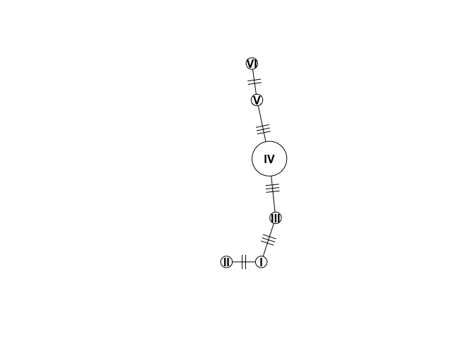
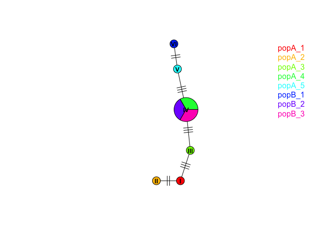
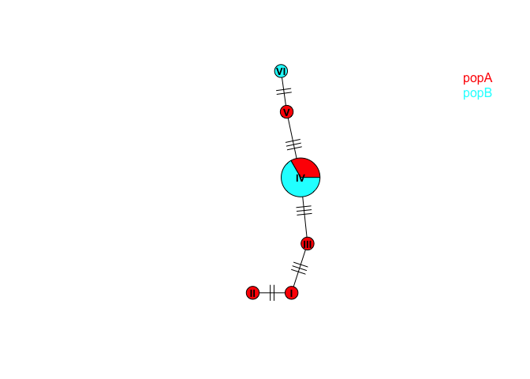

Haplotype network
================
Ludovic Dutoit
September 9, 2018

This is a toy analysis with uninteresting sequences to set up an easy pipeline for haplotype network analysis in R.

I used the code from:

<https://johnbhorne.wordpress.com/2016/09/15/still-making-haplotype-networks-the-old-way-how-to-do-it-in-r/>

and

<https://arundurvasula.wordpress.com/2016/02/24/haplotype-networks-in-r/>

but I combined them and reorganised a bit.

``` r
#Load the libraries
library("ape")
library("pegas")
```

For this analysis,we need a fasta file consisting of aligned sequences. Those can be obtained from many tools, including [MAAFT](https://mafft.cbrc.jp/alignment/server/) and [clustal omega](https://www.ebi.ac.uk/Tools/msa/clustalo/). The presented fasta file is [sample\_network.fa](https://github.com/ldutoit/personal_libraries/blob/master/test_files/sample_network.fa) in the folder test files in this repository..

Preparing the data and constructing the network
-----------------------------------------------

``` r
input <- "sample_network.fa" # name of input file
d <- read.dna(input, format='fasta') # read the aligned fasta file
e <- dist.dna(d) # make a mtrix of dna distances 
h <- haplotype(d) # summarize those distances as haplotypes
h
```

    ## 
    ## Haplotypes extracted from: d 
    ## 
    ##     Number of haplotypes: 6 
    ##          Sequence length: 404 
    ## 
    ## Haplotype labels and frequencies:
    ## 
    ##   I  II III  IV   V  VI 
    ##   1   1   1   3   1   1

``` r
hnet <- haploNet(h) # summarize those haplotypes as a network
hnet
```

    ## Haplotype network with:
    ##   6 haplotypes
    ##   7 links
    ##   link lengths between 2 and 3 steps
    ## 
    ## Use print.default() to display all elements.

Now that we have the network, let's see which samples correspond which haplotypes

``` r
ind.hap <-with(
stack(setNames(attr(h, "index"), rownames(h))),
table(hap=ind, pop=rownames(d)[values])) 
ind.hap
```

    ##      pop
    ## hap   popA_1 popA_2 popA_3 popA_4 popA_5 popB_1 popB_2 popB_3
    ##   I        1      0      0      0      0      0      0      0
    ##   II       0      1      0      0      0      0      0      0
    ##   III      0      0      1      0      0      0      0      0
    ##   IV       0      0      0      1      0      0      1      1
    ##   V        0      0      0      0      1      0      0      0
    ##   VI       0      0      0      0      0      1      0      0

Visualisation
-------------

At this step we can make the simplest picture of this very simple haplotype network.

``` r
plot(hnet, size = attr(hnet, "freq"), fast = F)
```



The "freq" attribute makes sure the size of the node is proportional to the frequency of the haplotype.

We can visualize this with coloring per samples:

``` r
plot(hnet, size=attr(hnet, "freq"), scale.ratio = 1, cex = 0.8, pie=ind.hap)
legend("topright", colnames(ind.hap), text.col=rainbow(ncol(ind.hap)), bty = "n")
```



That is great! But we might be interested in visualising this with colors per populations too. This requires a bit of messing around to replace individual names by population names. and then re compute haplotype frequencies per populations.

In your fasta file, make sure that individual names come after population name such as "popA\_1" for individual 1 coming from population A.

``` r
#identify locations sample per sample
populations <- strsplit(as.character( colnames(ind.hap)), "_")
populations <- sapply(populations, "[[", 1)
populations
```

    ## [1] "popA" "popA" "popA" "popA" "popA" "popB" "popB" "popB"

``` r
# get a data frame of haplotypes per sample
df <- as.data.frame(ind.hap)
unique <- df[df$Freq == 1,]
unique
```

    ##    hap    pop Freq
    ## 1    I popA_1    1
    ## 8   II popA_2    1
    ## 15 III popA_3    1
    ## 22  IV popA_4    1
    ## 29   V popA_5    1
    ## 36  VI popB_1    1
    ## 40  IV popB_2    1
    ## 46  IV popB_3    1

``` r
#combine locations and haplotypes per population
new.hap <- table(unique$hap, populations)
new.hap
```

    ##      populations
    ##       popA popB
    ##   I      1    0
    ##   II     1    0
    ##   III    1    0
    ##   IV     1    2
    ##   V      1    0
    ##   VI     0    1

``` r
plot(hnet, size=attr(hnet, "freq"), scale.ratio = 1, cex = 0.8, pie=new.hap)
legend("topright", colnames(new.hap), text.col=rainbow(ncol(new.hap)), bty = "n")
```



NOTE: in this case the haplotype network does not make much sense as it is a completely random alignment quickly generated to create this tutorial.
